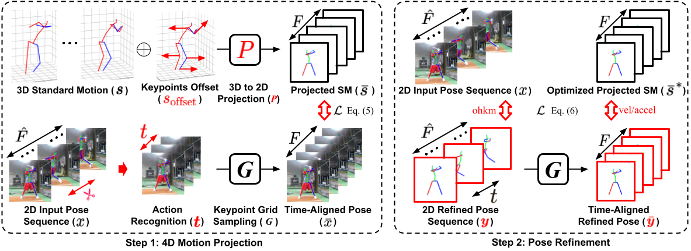

# Accurate Baseball Player Pose Refinement Using Motion Prior Guidance



## Contributions

- We propose Baseball Player Pose Corrector (BPPC), an optimization technique for refining keypoints in baseball batting, leveraging prior knowledge of the 3D swing motion.

- We introduce a 4D keypoint projection method that accurately matches 3D standard motions to 2D test
videos, regardless of the differences between the standard motion and test swing videos.

- We propose a loss function that adaptively optimizes poses based on keypoint confidence and movements.

- BPPC improves the quantitative and qualitative performance of state-of-the-art HPE models on benchmark datasets.

## Getting Started

### Environment Requirement

Clone the repo:

```bash
git clone https://github.com/BPPE-BaseballPlayerPoseEstimation/BPPC.git
```

Install the bppc requirements using `conda`:
```bash
conda env create -f bppc.yaml

pip install yacs==0.1.8 filterpy

cd grid_sample1d/
python setup.py install
cd ..
```

Prepare the [checkpoints](https://drive.google.com/drive/folders/1vXUerOenwrbp0clkALKPehKkvq5HWvQK?usp=drive_link):

```
${POSE_ROOT}
    `-- lib
        `-- checkpoints
            |-- darkpose
            |   |-- w32_384×288.pth
            |   `-- w48_384×288.pth
            |-- hrnet
            |   |-- pose_hrnet_w32_384x288.pth
            |   `-- pose_hrnet_w48_384x288.pth
            |-- resnet
            |    |-- pose_resnet_50_384x288.pth
            |    |-- pose_resnet_101_384x288.pth
            |    `-- pose_resnet_152_384x288.pth
            `-- yolo3.weights
```


### Test

Test the left-handed batter:
```bash
sh run_left.sh
```

Test the right-handed batter:
```bash
sh run_right.sh
```

## Citation

```
@article{OH2025,
    title = {Accurate baseball player pose refinement using motion prior guidance},
    journal = {ICT Express},
    year = {2025},
    issn = {2405-9595},
    doi = {https://doi.org/10.1016/j.icte.2025.03.008},
    url = {https://www.sciencedirect.com/science/article/pii/S2405959525000360},
    author = {Seunghyun Oh and Heewon Kim},
    keywords = {Human pose estimation, Human pose refinement, Deep learning}
}
```

## Acknowledgement

- The repo (`grid_sample1d`) is based on [Grid Sample 1d](https://github.com/luo3300612/grid_sample1d.git). Thanks for their well-organized code!
